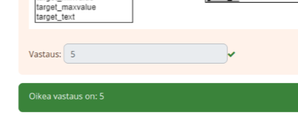
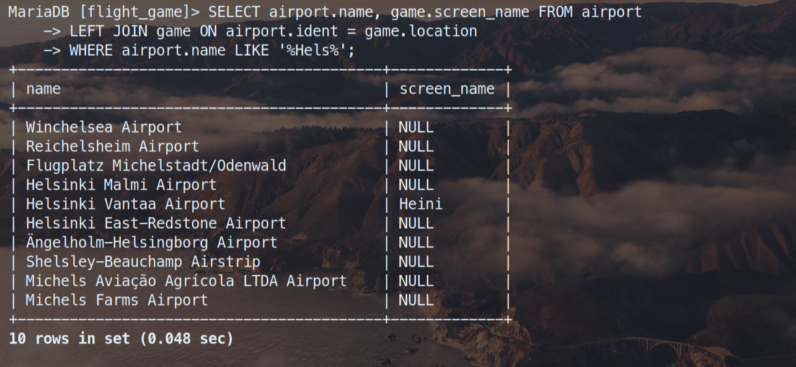
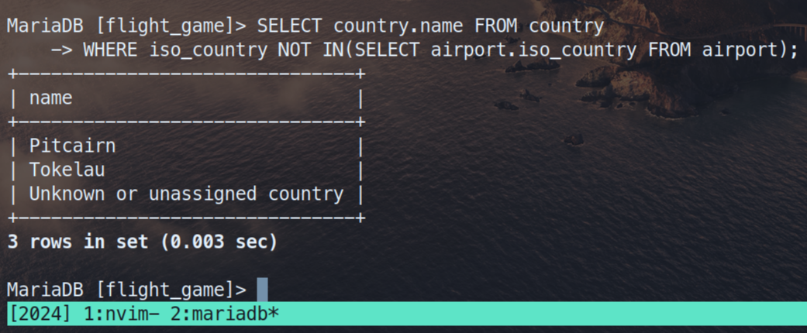
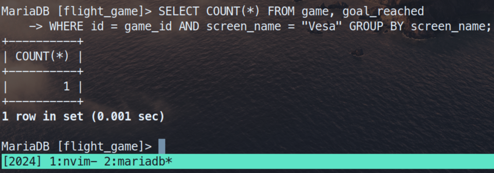

# Relaatiotietokanta Tehtävät

## 1 Relaatiotietokannan peruskäsitteiden harjoitukset

### 1.1
```
Kuinka monta taulua alla olevan relaatiomallin mukaisessa tietokannassa on?

vastaus: 5
```


### 1.2
```
Katso alla olevaa relaatio-mallia. Kuinka monta saraketta taulussa country on?

vastaus: 5
```


### 1.3
```
Katso alla olevaa relaatio-mallia. Mikä on taulun airport pääavainkentän nimi?

vastaus: ident
```


### 1.4
```
Avaa Moodlesta (Viikko 1 kohdalla) löytyvä airports.csv-tiedosto Notepad++:lla
(älä avaa Excelillä, Excel saattaa tehdä muutoksia, jotka haittaavat
seuraavissa työvaiheissa). Mikä tietotyyppi sopisi
airport-taulun pääavainkenttään?

vastaus: id
```


### 1.5
```
Katso alla olevaa relaatio-mallia. Minkä niminen vierasavainkenttä
airport-taulussa on?

vastaus: iso_country
```


### 1.6
```
Katso alla olevaa relaatiomallia. Minkä nimiseen tauluun airport-taulun
vierasavainkenttä osoittaa?

vastaus: country
```


### 1.7
```
Katso alla olevaa relaatiomallia. Minkä nimiseen kenttään airport-taulun
vierasavainkenttä osoittaa?

vastaus: country
```


### 1.8
```
Kurkista taas airports.csv-tiedostoon. Mikä tietotyyppi sopisi
airport-taulun vierasavainkenttään?

vastaus: ei mikään, koska siinä on vain yksi taulu, mutta edellisen
tehtävän diagram perustella iso_country
```


### 1.9
```
Airport-tauluun tullaan myöhemmin importoimaan data airports.csv-tiedostosta.
Kurkista taas airports.csv-tiedostoon. Kuinka monta tietuetta eli riviä
dataa meillä tulee olemaan airport-taulussa?

vastaus: 18
```


### 1.10
```
Katso alla olevaa relaatiomallia. Mikä on taulun country pääavain kentän nimi?

vastaus: ident
```


### 1.11
```
Tehtävissä 6 ja 7 kerroit, että airport-taulun vierasavain osoittaa
country-taulun pääavaimeen. Tehtävässä 8 päättelit csv-tiedoston perusteella
airport-taulun vierasavainkentän tietotyypin. Edeltävän perusteella tiedät
country-taulun pääavainkentän tietotyypin. Mikä se on?

vastaus: varchar jokun pituinen 255, mutta yleiseti ottaen kannataisi
mielummin olla CUID, UUID tai pelkä autoincrement id(0,1,...)
```


### 1.12
```
Avaa Moodlesta löytyvä countries.csv-tiedosto Notepad++:lla (älä avaa
Excelillä, Excel saattaa tehdä muutoksia, jotka haittaavat seuraavissa
työvaiheissa). Kuinka monta tietutetta eli riviä dataa
meillä tulee olemaan country-taulussa?

vastaus: 6
```


### 1.13
```
Katso alla olevaa taulun goal data-sisältö attachments/1.1a ja relaatiomallia.
Minkä nimisessä taulussa on attachments/1.1us eri säätiloista?

vastaus: goal
```


### 1.14
```
Katso alla olevaa attachments/1.1a taulun goal data-sisällöstä. Minkä niminen on säätila,
jonka attachments/1.1uksessa sanotaan, että sää on tasan 0-asetta.

vastaus: 0DEG
```


### 1.15
```
Katso alla olevaa relaatiomallia. Minkä niminen on goal-taulun pääavainkenttä?

vastaus: id
```


### 1.16
```
Katso alla olevaa relaatio-mallia. Onko goal-taulussa vierasavainta?

vastaus: epätosi
```


### 1.17
```
Katso alla olevaa relaatio-mallia. Minkä nimisessä taulussa
pidetään yllä pelaajan nimimerkkiä?

vastaus: game
```


### 1.18
```
Katso alla olevaa relaatiomallia. Minkä nimisessä taulussa
ylläpidetään kokonaisbudjettia CO2-päästöille?

vastaus: game
```


### 1.19
```
Katso allaolevaa relaatio-mallia. Minkä nimisessä taulussa ylläpidetään
pelaajan kuluttamaa CO2 päästöä?

vastaus: game
```


### 1.20
```
Katso alla olevaa relaatiomallia. Minkä nimisessä taulussa ylläpidetään
tietoa siitä missä pelaaja sijaitsee?

vastaus: airport
```


### 1.21
```
Katso alla olevaa relaatio-mallia. Minkä niminen on game-taulun pääavain?

vastaus: id
```


### 1.22
```
Katso alla olevaa relaatio-mallia.
Minkä niminen on game-taulun vierasavainkenttä?

vastaus: location
```


### 1.23
```
Katso alla olevaa olevaa relaatio-mallia. Minkä nimisessä taulussa ylläpidetään
tietoa siitä, mitkä tavoitelluista säätiloista ovat
missäkin peli-sessiossa tavoitettu?

vastaus: goal_reached
```


### 1.24
```
Katso alla olevaa relaatio-mallia. Kaksi eri kenttää yhdessä muodostavat
goal_reached-taulun pääavaimen. Mitkä nämä kentät ovat nimeltään?

Automaattitarkistuksen takia kirjoita kaaviossa oleva ensinmainittu kentän
nimi ensin vastaukseesi, sen jälkeen pilkku ja välilyönti,
lopuksi kaaviossa toisena mainittu kentän nimi.

vastaus: goal_id ja game_id
```


### 1.25
```
Katso alla olevaa relaatio-mallia. Kuinka monta
vierasavainta on goal_reached-taulussa?

vastaus: 2
```


## 2 Yhteen tauluun kohdistuvien kyselyiden harjoitukset

### 2.1
```sql
SELECT * FROM goal;
```


### 2.2
```sql
SELECT name airport_type FROM airport WHERE iso_country='FI';
```


### 2.3
```sql
SELECT name FROM airport WHERE iso_country='FI' ORDER BY name;
```


### 2.4
```sql
SELECT name, type FROM airport WHERE iso_country = "FI" ORDER BY type, name;
```


### 2.5
```sql
SELECT name FROM country WHERE name LIKE 'F%';
```


### 2.6
```sql
SELECT name FROM country WHERE name LIKE '%F%';
```


### 2.7
```sql
SELECT location FROM game WHERE screen_name='Vesa';
```


### 2.8
```sql
SELECT co2_consumed FROM game WHERE screen_name='Ilkka';
```


### 2.9
```sql
SELECT DISTINCT co2_budget FROM game;
```


## 3 Where-osan liitosehto harjoitukset

### 3.1
```sql
SELECT country.name AS "country name", airport.name AS "airport name"
FROM airport, country
WHERE airport.iso_country = country.iso_country AND country.name = "Iceland";
```


### 3.2
```sql
SELECT airport.name AS "airport name" FROM airport, country
WHERE airport.iso_country = country.iso_country
AND country.name = "France" AND airport.type = "large_airport";
```


### 3.3
```sql
SELECT country.name AS country_name, airport.name AS airport_name
FROM airport, country
WHERE airport.iso_country = country.iso_country AND country.continent = "AN";
```


### 3.4
```sql
SELECT elevation_ft FROM airport, game
WHERE location = ident AND screen_name = "Heini";
```


### 3.5
```sql
SELECT elevation_ft * 0.3048 AS elevation_m FROM airport, game
WHERE location = ident AND screen_name = "Heini";
```


### 3.6
```sql
SELECT name FROM airport, game
WHERE location = ident AND screen_name = "Ilkka";
```


### 3.7
```sql
SELECT country.name FROM airport, game, country
WHERE location = ident
AND airport.iso_country = country.iso_country AND screen_name = "Ilkka";
```


### 3.8
```sql
SELECT name FROM goal, goal_reached, game
WHERE game.id = game_id AND goal.id = goal_id AND screen_name = "Heini";
```


### 3.9
```sql
SELECT airport.name FROM airport, game, goal, goal_reached
WHERE ident = location AND game.id = game_id
AND goal.id = goal_id AND screen_name = "Ilkka" AND goal.name = "CLOUDS";
```


### 3.10
```sql
SELECT country.name FROM country, airport, game, goal, goal_reached
WHERE airport.iso_country = country.iso_country AND ident = location
AND game.id = game_id AND goal.id = goal_id
AND screen_name = "Ilkka" AND goal.name = "CLOUDS";
```


## 4 Join harjoitukset

### 4.1
```sql
SELECT country.name AS "country name", airport.name AS "airport name"
FROM country INNER JOIN airport ON airport.iso_country = country.iso_country
WHERE country.name = "Finland" AND scheduled_service = "yes";
```


### 4.2
```sql
SELECT screen_name, airport.name FROM game
INNER JOIN airport ON location = ident;
```


### 4.3
```sql
SELECT screen_name, country.name FROM game
INNER JOIN airport ON location = ident
INNER JOIN country ON airport.iso_country = country.iso_country;
```


### 4.4
```sql
SELECT airport.name, game.screen_name FROM airport
LEFT JOIN game ON airport.ident = game.location
WHERE airport.name LIKE '%Hels%';
```


### 4.5
```sql
SELECT name, screen_name FROM goal
LEFT JOIN goal_reached ON goal.id = goal_id LEFT JOIN game ON game.id = game_id;
```


## 5 Sisäkysely harjoitukset

### 5.1
```sql
SELECT name FROM country WHERE iso_country IN(
SELECT iso_country FROM airport WHERE name LIKE "Satsuma%");
```


### 5.2
```sql
SELECT name FROM airport WHERE iso_country
IN(SELECT iso_country FROM country WHERE name = "Monaco");
```


### 5.3
```sql
SELECT screen_name FROM game WHERE id IN(
SELECT game_id FROM goal_reached
WHERE goal_id IN(SELECT id FROM goal WHERE name = "CLOUDS"));
```


### 5.4
```sql
SELECT country.name FROM country
WHERE iso_country NOT IN(SELECT airport.iso_country FROM airport);
```


### 5.5
```sql
SELECT name FROM goal WHERE id
NOT IN(SELECT goal.id FROM goal, goal_reached, game
WHERE game.id = game_id AND goal.id = goal_id AND screen_name = "Heini");
```


## 6 Koostetieto kyselyt harjoitukset

### 6.1
```sql
SELECT elevation_ft as "max elevation_ft" FROM airport
WHERE elevation_ft IN(SELECT MAX(elevation_ft) FROM airport);
```


### 6.2
```sql
SELECT continent, COUNT(*) FROM country GROUP BY continent;
```


### 6.3
```sql
SELECT screen_name, COUNT(*) FROM game, goal_reached
WHERE id = game_id GROUP BY screen_name;
```


### 6.4
```sql
SELECT screen_name FROM game
WHERE co2_consumed IN(SELECT MIN(co2_consumed) FROM game);
```


### 6.5
```sql
SELECT country.name, COUNT(*) FROM airport, country
WHERE airport.iso_country = country.iso_country
GROUP BY country.iso_country ORDER BY COUNT(*) desc LIMIT 50;
```


### 6.6
```sql
SELECT country.name FROM airport, country
WHERE airport.iso_country = country.iso_country
GROUP BY country.iso_country HAVING COUNT(*) > 1000;
```


### 6.7
```sql
SELECT name FROM airport
WHERE elevation_ft = (SELECT MAX(elevation_ft) FROM airport);
```


### 6.8
```sql
SELECT name FROM country WHERE iso_country IN(
SELECT iso_country FROM airport WHERE elevation_ft
IN(SELECT MAX(elevation_ft) FROM airport));
```


### 6.9
```sql
SELECT COUNT(*) FROM game, goal_reached
WHERE id = game_id AND screen_name = "Vesa" GROUP BY screen_name;
```


### 6.10
```sql
SELECT name FROM airport ORDER BY ABS(latitude_deg) DESC LIMIT 1;
```


## 7 Päivityskyselyt harjoitukset

### 7.1
```sql
UPDATE game
SET location = (SELECT ident FROM airport WHERE name = "Nottingham Airport"), co2_consumed = co2_consumed+500
WHERE screen_name = "Vesa";

SELECT * FROM game;
```


### 7.2
```
b. game
```


### 7.3
```sql
DELETE FROM goal_reached;
```


### 7.4
```sql
DELETE FROM game;
```


## 8 Tietokannan suunnittelu harjoitukset

### 8.1
```
Katso alla olevaa ER-mallia. Mikä on airport yksilötyypin tunnistava ominaisuus?

vastaus: ident
```


### 8.2
```
Katso alla olevaa ER-mallia. Kuvassa on yhteys airport ja country
yksilötyyppien välillä. Yhteydellä on lukumäärärajoite yhden suhde moneen.
Kumpi yksilötyypeistä on ns. moneen pää?

vastaus: country
```


### 8.3
```
Katso alla olevaa ER-mallia. Kuvassa on yhteys airport ja country
yksilötyyppien välillä. Yhteydellä on lukumäärärajoite yhden suhde moneen.
Tarkoittaako tämä:

vastaus: b. Maassa voi olla monta lentokenttää
```


### 8.4
```
Jokaisesta ER-kaavion yksilötyypistä syntyy relaatiomallin taulu

vastaus: tosi
```


### 8.5
```
Jokaisesta ER-kaavion yhteydestä syntyy relaatiomallin taulu

vastaus: epätosi
```


### 8.6
```
Katso alla olevaa ER-mallia. Kuvassa on yhteys airport ja country
yksilötyyppien välillä. Yhteydellä on lukumäärärajoite yhden suhde moneen.
Kun tämä kohta muutetaan relaatiomalliksi, tarkoittaako tämä:

vastaus: b. airport-tauluun tulee viiteavain country-tauluun
```


### 8.7
```
Katso alla olevaa ER-mallia. Kuvassa on yhteys airport ja game yksilötyyppien
välillä. Yhteydellä on lukumäärärajoite yhden suhde moneen. Kun tämä kohta
muutetaan relaatiomalliksi, tarkoittaako tämä:

vastaus: a. game-tauluun tulee viiteavain airport-tauluun
```


### 8.8
```
Katso alla olevaa ER-mallia. Kuvassa on yhteys game ja goal yksilötyyppien
välillä. Yhteydellä on lukumäärärajoite monen suhde moneen. Tarkoittaako tämä:
Pelissä voi olla monta tavoitetta ja tavoite voi olla monessa pelissä

vastaus: tosi
```


### 8.9
```
Katso alla olevaa ER-mallia. Kuvassa on yhteys game ja goal yksilötyyppien
välillä. Yhteydellä on lukumäärärajoite monen suhde moneen. Kun tämä kohta
muutetaan relaatiomalliksi, tarkoittaako tämä:

vastaus: b. Yhteyden salmiakista tulee oma taulunsa
```


### 8.10
```
Katso alla olevaa ER-mallia. Jos sinulla on goal_reached yhteyden salmiakista
syntynyt taulu relaatiomallissa. Siihen tulee viiteavaimet seuraavasti:

vastaus: a. Viiteavain sekä goal-tauluun että game-tauluun
```

